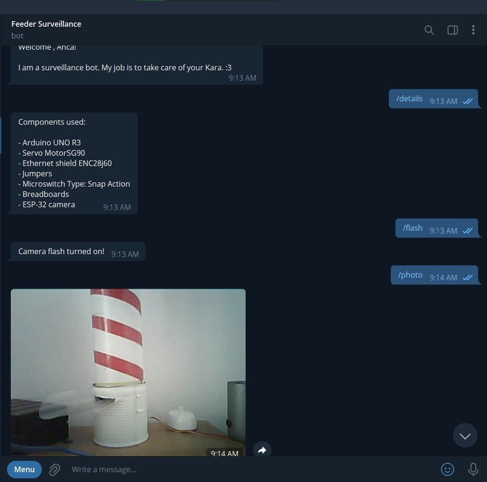

# Cat Feeder controlled by a Telegram bot via mobile app 

## 1. Obiectivele proiectului propus

Proiectul propus are ca obiectiv principal ușurarea modului de hrănire a animalelor de companie. Acest produs se adresează oricărui deținător de pisici sau/și câini, el făcând parte din ramura produselor destinate pentru segmentul de “Smart-Home”.
Dispenserul de mâncare este un obiect ușor de folosit și o metodă convenabilă de hrănire a pisicii sau câinelui dumneavoastră, mai ales dacă sunteți o persoană cu un timp limitat și doriți să petreceți mai mult timp cu animalul dumneavoastră de companie jucându-vă.

Cele trei metode prin care feeder-ul va putea fi controlat:
1. Animalul de companie apasă pe un buton, acționând servo-motorul, iar utilizatorul primește o notificare pe telefon pentru a fi înștiințat de acest lucru
2. Utilizatorul trimite comanda /feed pe telefon, cu ajutorul unui bot de Telegram, servo-motorul fiind acționat de un server (serializarea si deserializarea unui byte)
3. Utilizatorul trimite comanda /photo pe telefon, ce va determina trimiterea unei poze, pe server cu starea actuala a feeder-ului

## 2. Descrierea soluției propuse

Soluția pe care am propus-o este implementarea unui dispenser de mancare, ce este ușor de folosit si simplist construit din materiale reciclabile.
Așadar, am construit un dispenser de mâncare pentru animele din materiale ușor de accesat: două conserve cilindrice de diametre diferite pentru a putea culisa una peste alta, un recipient de plastic unde ajunge mâncarea pe care o poate mânca animalul de companie și o cutie de carton în care se află aparatura hardware pentru funcționarea aparatului. În ceea ce privește partea software a acestui proiect, ne-am propus sa acționăm servo-motorul prin intermediul aplicației Telegram și al unui buton, aspecte ce vor fi realizate prin prisma protocolului TCP.

## 3. Componentele utilizate

1. Placă de dezvoltare UNO R3 compatibil Arduino x 2
2. Servomotor SG90
3. Shield rețea ENC28j60 ethernet
4. Fire pentru conexiune
5. Microswitch Type: Snap Action
6. Mini-breadboard
7. ESP-32 camera

## 4. Inițializarea și configurarea botului de Telegram
Inițializare botului de Telegram se face prin intermediul unui BotFather cu comanda /newbot, astfel că, utilizatorul trimite nițte comenzi pe această aplicație pentru a-și configura propriul chatbot care, va căpăta sens + utilitate practică in momentul in care va fi programat pe calculator.

Odată ce botul de Telegram a fost inițializat, vom folosi biblioteca Telegraf împreună cu NodeJS care este un framework pentru siteuri, servicii și aplicații scrise in Javascript.

Comenzile trimise de pe Telegram acționeaza callback-uri lambda pe serverul realizat prin protocolul TCP. Comanda de hrănire, de exemplu, verifică dacă feederul este conectat la serverul
de control și ii trimite un byte pentru a determina actionarea servomotorului. Totodată, utilizatorul primește un mesaj pe telefon pentru a fi inștiințat dacă nu au fost erori.

Atunci când feederul primește un byte, acționează servo motorul, iar când serverul primește un byte de la feeder, știm că pisica a apăsat pe butonul fizic, hrăndindu-se singură.

Pentru pornirea efectiva a serverului se dă comanda node index.js.

Codul de pe placa de dezvoltare Arduino presupune conectarea la server cu ajutorul IP-ului local al laptopului si al adresei MAC precum și implementarea celor două scenari.

Pentru implementarea functionalitatii camerei ESP32 CAM, ce presupune conectarea acesteia la bot-ul de Telegram, am folosit biblioteca Universal Arduino-Telegram Bot. 

## 5. Comenzile botului de Telegram

- start - short intro (scurta descriere)
- help - show all the commands available (afișarea tuturor acestor comenzi)
- details - show all the components used
- feed - feed my Kara (hrănirea pisicii)
- credits - and the 1st prize goes to ... 
- photo - take a photo of the current state of the feeder
- flash - toggles the flash of the camera

## 6. Testarea soluției
Testarea solutiei s-a realizat prin intermediul robotului fizic conectat la calculator prin intermediul unui cablu de ethernet. Asigurându-ne de faptul că avem o conexiune Wi-Fi stabilă, am pornit serverul cu ajutorul comenzii node index.js. De mentionat este faptul ca ESP32 CAM dispune de un modul Wi-Fi, conectarea acesteia la bot-ul de Telegram realizându-se wireless.

În prima instanță, s-a verificat funcționalitatea de acționare prin apăsare pe buton, eveniment ce produce transmiterea unui anumit tip de date (un byte) către server, ca mai apoi să fie preluat si transformat într-o comandă ce prevede evacuarea mâncării.

Funcționalitatea ce are ca subiect conectarea la aplicația de Telegram prin intermediul API-ului open source, a fost testată, cu serverul pornit, comunicând cu botul pe care l-am creat. Astfel, după ce am setat lista de comenzi (/setcommands) prin BotFather si după ce le-am atribuit câte o semantică (primirea unui mesaj text ca raspuns), am testat comanda /feed ce acționează motorul în mod instant.

Codul ce presupune redarea pozei a fost implementat in fisierul TelegramCamera. Acesta primeste token-ul corespunzator bot-ului de Telegram, informatii despre conexiunea Wi-Fi si se foloseste de un client TCP pentru a transmite reda poza, respectiv pentru a porni flash-ul camerei.

Totodată, codul de Arduino conține o funcție de reconectare automată, reconnect(), în cazul în care nu se mai face conexiunea la master server, prevenind astfel comportamentul imprevizibil generat de potențialele erori sau de fluctuații ale vitezei cu care se transmit datele prin internet.

## Proiecte similare

https://www.hackster.io/jrance/cat-feeder-with-esp8266-arduino-and-telegram-61c4e6 - Pet feeder controlat de un bot de Telegram ce contine un shield de ethernet ESP8266 si in plus fata de propunerea mea, un senzor ultrasonic. Comenzi implementate in plus: /clean, /ip, /status. 

https://www.instructables.com/Pet-Feeder-Machine-With-RasPi-and-Telegram-Bot/ - Acest pet feeder este realizat prin intermediul unui server hostat pe Raspberry Pi. Serverul proiectului meu va fi realizat cu Node.js, folosind un Arduino board.

https://www.instructables.com/Smart-Pet-Feeder-1/ - Acest proiect contine si un robot auxiliar pentru asigurarea apei si niste statistici actualizate in timp real cu resursele feeder-ului.  

## Bibliografie

https://www.youtube.com/watch?v=5MHisFC-_dE

https://how2electronics.com/interface-enc28j60-ethernet-module-with-arduino/

https://www.youtube.com/watch?v=hCvOzzDa1ms&t=124s

https://www.youtube.com/watch?v=kEG8cd32fb0

https://www.chatcompose.com/ro/telegram.html
